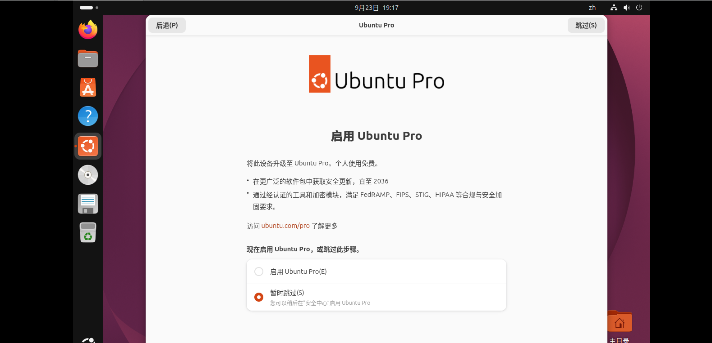
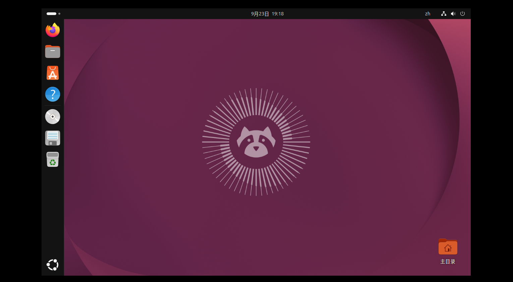
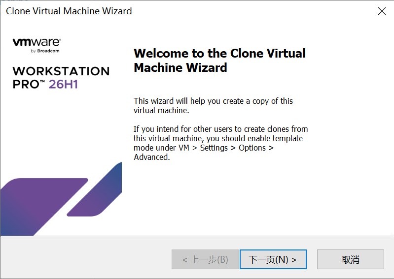
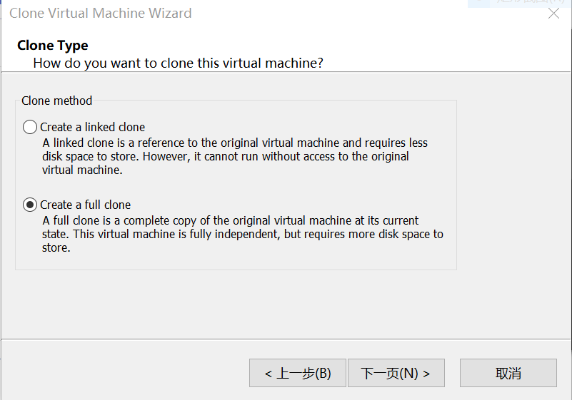
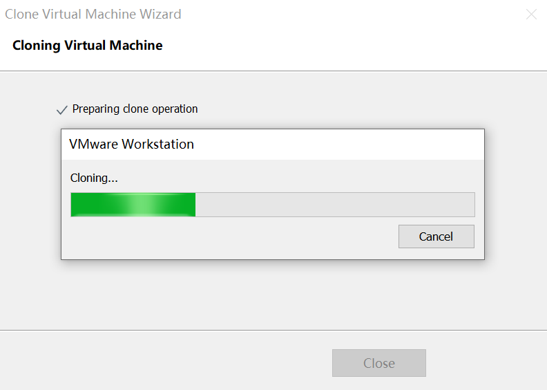
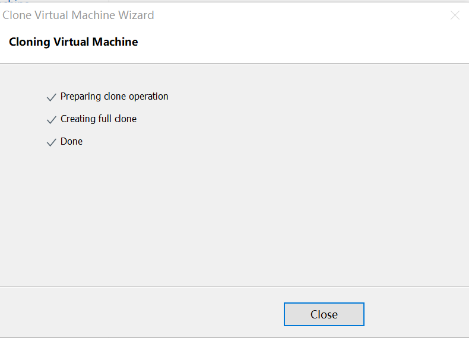

实验报告

1.进入<https://cn.ubuntu.com/>官网，找到Desktop版

{width="5.768055555555556in"
height="1.6034722222222222in"}

点击"Ubuntu桌面系统"进入

{width="5.768055555555556in"
height="1.7in"}

点击"下载Ubuntu"

{width="5.768055555555556in"
height="1.9840277777777777in"}

安装完毕后获得iso格式文件

2.进入VMware Workstation点击Create

{width="5.768055555555556in"
height="2.951388888888889in"}

选择自定义下载

{width="4.444673009623797in"
height="4.396059711286089in"}

硬件兼容配置

{width="4.444673009623797in"
height="4.396059711286089in"}

选择光盘镜像所在位置

{width="4.444673009623797in"
height="4.396059711286089in"}

安装信息填写

命名虚拟机

{width="4.444673009623797in"
height="4.396059711286089in"}

处理器配置

{width="3.776922572178478in"
height="3.7356135170603673in"}

内存设置

{width="3.515384951881015in"
height="3.476935695538058in"}

网络类型设置-选择NAT连接方式

{width="4.098675634295713in"
height="4.053846237970253in"}

选择控制器类型-默认推荐

{width="4.444673009623797in"
height="4.396059711286089in"}

磁盘类型-默认推荐

{width="4.444673009623797in"
height="4.396059711286089in"}

选择磁盘-创建新磁盘

{width="3.6164785651793525in"
height="3.5769236657917762in"}

分配磁盘容量-使用默认20G

{width="4.697276902887139in"
height="4.6384623797025375in"}

指定磁盘文件存储位置-选择默认位置

{width="3.834245406824147in"
height="3.792308617672791in"}

完成设置

{width="4.444673009623797in"
height="4.396059711286089in"}

在虚拟机中继续安装Ubuntu

{width="5.768055555555556in"
height="3.8381944444444445in"}

{width="5.768055555555556in"
height="3.0708333333333333in"}

选择语言，键盘等-使用默认值

{width="5.768055555555556in"
height="3.064583333333333in"}

{width="5.768055555555556in"
height="3.064583333333333in"}

选择交互式安装{width="5.768055555555556in"
height="3.064583333333333in"}

安装选择默认方式

{width="5.768055555555556in"
height="2.814583333333333in"}

加密选择无加密

{width="5.768055555555556in"
height="3.4006944444444445in"}

设置个人账户

{width="5.768055555555556in"
height="3.4631944444444445in"}

安装完成，进行后续设置

{width="5.768055555555556in"
height="2.7875in"}

安装完成

{width="5.768055555555556in"
height="3.1819444444444445in"}

3.克隆Ubuntu

点击管理-克隆

{width="5.548896544181977in"
height="3.9377023184601927in"}

创建完整克隆{width="5.768055555555556in"
height="4.039583333333334in"}

{width="5.500282152230971in"
height="3.9168678915135606in"}

克隆完成

{width="5.486393263342082in"
height="3.9585367454068243in"}
