实验手册

1.pwd(print working directory)显示当前工作目录

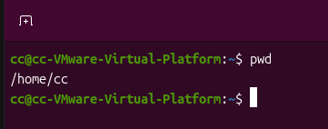{width="2.5070734908136485in"
height="0.9861614173228347in"}

2.ls(list) 列出当前目录下的文件和子目录

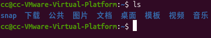{width="2.9237609361329833in"
height="0.5278051181102362in"}

3.mkdir(make directory)

mkdir web test 创建多个目录

mkdir -p web/test 创建指定目录

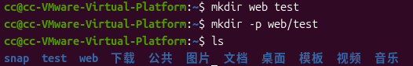{width="3.652965879265092in"
height="0.5903083989501312in"}

4.cd(change directory) 切换目录

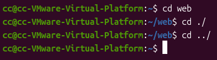{width="2.4862390638670164in"
height="0.6875349956255468in"}

5.touch 创建空文件

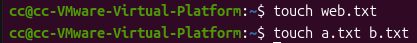{width="2.8959820647419074in"
height="0.2986264216972878in"}

6.echo 打印输出文本

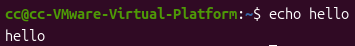{width="2.465404636920385in"
height="0.3194608486439195in"}

echo "xxx"\>\>x.txt 将输出文本追加到文件末尾

\>会覆盖原文件，\>\>会保留原文件内容

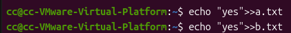{width="2.9237609361329833in"
height="0.33335083114610675in"}

{width="4.778023840769904in"
height="1.4445188101487314in"}

{width="2.791809930008749in"
height="0.17361986001749782in"}

{width="4.854416010498688in"
height="0.7708727034120735in"}

{width="3.027933070866142in"
height="0.16667541557305338in"}

{width="4.8127471566054245in"
height="0.840320428696413in"}

7.cat(concatenate) 显示文件内容

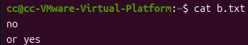{width="2.4237357830271216in"
height="0.4444674103237095in"}

8.tail 从文件末尾显示指定数量的行

tail x.txt默认显示文件后10行

显示文件的最后一行

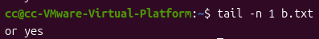{width="2.7570866141732284in"
height="0.34029527559055117in"}

9.head 从文件开头显示指定数量的行

默认显示文件前10行

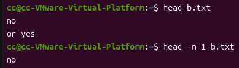{width="2.7987554680664917in"
height="0.798652668416448in"}

10.cp(copy) 将文件复制到另一个目录中

cp b.txt /home/cc/test将当前目录文件复制到另一个目录

（文件后不加空格会执行错误，使文件被归入目录范畴）

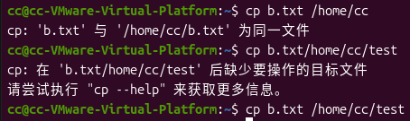{width="3.1529396325459316in"
height="0.9375481189851269in"}

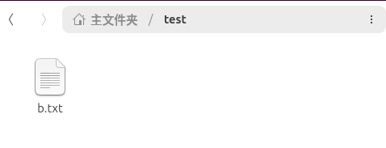{width="3.319615048118985in"
height="1.2708989501312336in"}

cp /home/cc/test/b.txt /home/cc/test 将此目录文件复制到另一个目录

cp /home/cc/test/b.txt /home/cc/test/newb.txr
将文件复制到另一个目录中并重命名

{width="4.4030041557305335in"
height="0.13195100612423447in"}

{width="3.444621609798775in"
height="1.090333552055993in"}

cp -r /home/cc/web/ /home/cc/test 将目录复制到另一个目录中(recursive
-r表示复制整个目录树的内容)

{width="3.7571380139982504in"
height="0.1458409886264217in"}

{width="3.3612839020122482in"
height="1.0000513998250218in"}

11.mv(move) 重命名或移动

重命名

{width="2.7709755030621173in"
height="0.19445428696412947in"}

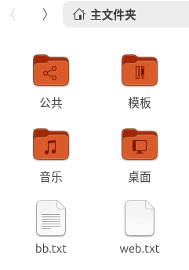{width="1.6736975065616797in"
height="2.3820669291338583in"}

移动文件

{width="3.2779461942257218in"
height="0.1458409886264217in"}

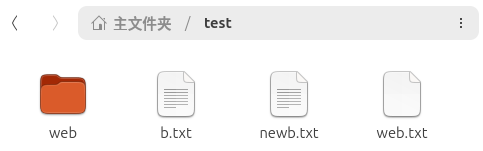{width="3.354339457567804in"
height="1.0486646981627297in"}

移动文件并重命名
